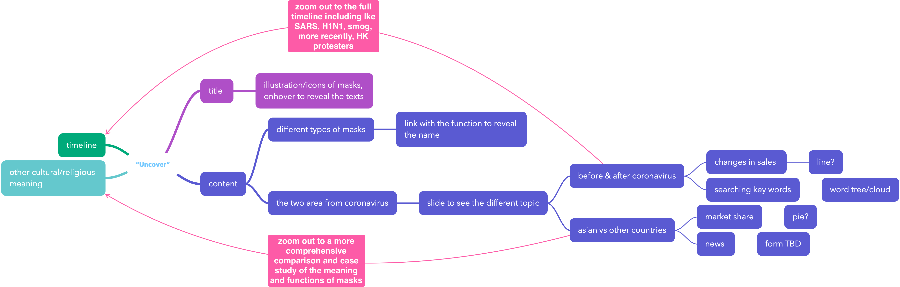

Week 1
1. Müller Meinard. Information Retrieval for Music and Motion. San Bernardino, CA: Springer, 2010.
2. Li, Tao, Mitsunori Ogihara, and George Tzanetakis. Music Data Mining. Boca Raton: CRC Press, 2012.
3. Warner, Malcolm, and Grace O. M. Lee. The Political Economy of the SARS Epidemic: the Impact on Human Resources in East Asia. London: Routledge, 2012.
4. Koh, Tommy, Aileen Plant, and Eng Hin Lee. The New Global Threat: Severe Acute Respiratory Syndrome and Its Impacts. Singapore: World Scientific, 2003.

Week 2

1. I’m visualizing the field recording captured in cities because I want to encourage people to utilize hearing, which has been usually neglected and overwhelmed by vision in everyday life, to experience their living space. I hope it can not only re-address the problem of noise in urban environment but also serve as an opportunity to discover the covered beauty and uniqueness of soundscape as the identity of a city.
- Soundscape
  - why
    - people tend to rely on what they see and ignore what they can hear
    - a new form of city exploration
    - for people to choose where they want to live
  - comparison based on geolocations
    - comparison of streets/specific locations
    - comparison of countries
    - comparison of cities
  - comparison based on time
  - creating a audio experience as a virtual trip an different perspective from existing VR tourism
  - design a game like Pokemon Go  to catch sounds
  - resources
    - aporee.org
      - pro:has an archive of sounds of different places from as early as 2000, so can be also used for a comparison based on timeline
      - con: locations are limited
    - soundsof.nyc by brether.com
      - pro: sounds of neighborhood and popular sites of NYC
      - con: the origin author team has left and cannot get the original data, need some further work
    - SONYC Urban Sound
      - pro: tagged
      - con: only 50 sensors in NYC

2. I’m visualizing the study of epidemic disease because the breakout of Coronavirus is a hot topic and flu in the United States is killing millions of people every year, and the way the public reaction, including how they think and act in daily life and on social media are also influenced by their cultures. There has been discriminations in Europe and the States against Asians who where masks because Asians tend to wear masks more often in daily life just to protect themselves against dust/allergy/viruses while in western countries, it is usually considered a medical measure for patients. I want to study from this perspective in order to present the difference and hopefully contribute to the mutual understanding between people.
- Epidemic disease
  - why
    - a threat to the world and easily causes social panic
    - Coronavirus is a very serious topic in china now and around the world
    - there are culturally differences in dealing with the breakout
  - SARS/Coronavirus VS flu
    - patients statistics
    - country difference
    - timeline (historical) difference
    - public reaction
      - what people do to prevent
        - masks?
        - vaccines?
      - what they say on Weibo vs Twitter
      - what they search online
      - popular commodities
    - impacts
      - social/economical
      - patients (after recovery)
  - recources
  - Wuhan2020
    - an open source project that gathers statistics for the Coronavirus in China
  - CDC
  - The Lancet
  - Twitter API
  - Google Search keyword
  - Weibo

Week 3

Interaction:

